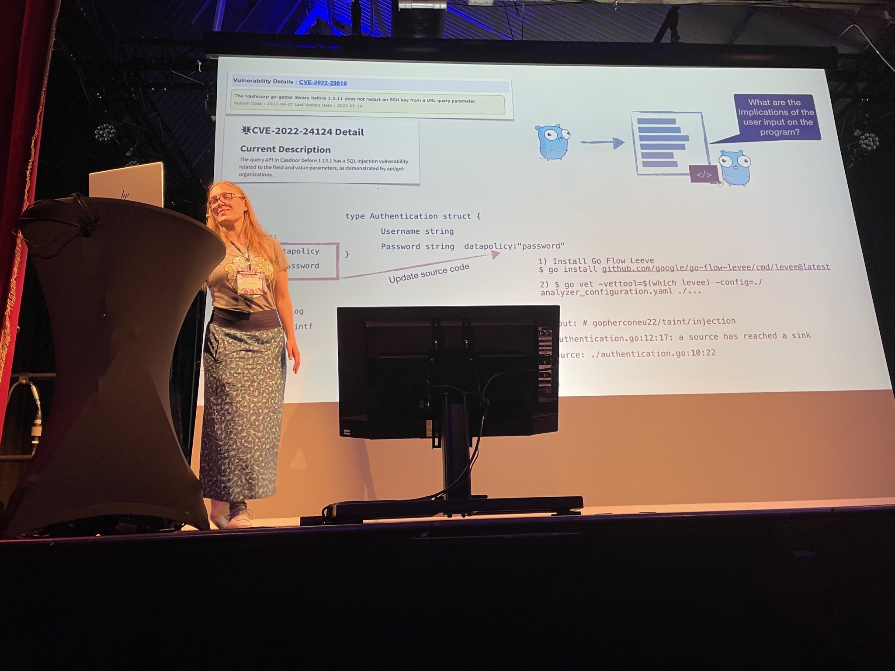

## My Thoughts about the Talk

<blockquote class="twitter-tweet" data-dnt="true">
Some thoughts about my <a href="https://twitter.com/gopherconeu?ref_src=twsrc%5Etfw">@gopherconeu</a> talk today. 📄 Slides, code, and impressions are now available online: <a href="https://t.co/65DgbHjq9y">https://t.co/65DgbHjq9y</a>   📸 by my partner. <a href="https://twitter.com/hashtag/golang?src=hash&amp;ref_src=twsrc%5Etfw">#golang</a> <a href="https://twitter.com/hashtag/gopherconEU?src=hash&amp;ref_src=twsrc%5Etfw">#gopherconEU</a> <a href="https://t.co/Pw1HsPOVt6">pic.twitter.com/Pw1HsPOVt6</a>
&mdash; Anna-Katharina Wickert @GophetConEU (@akwickert) <a href="https://twitter.com/akwickert/status/1553823903528665088?ref_src=twsrc%5Etfw">July 31, 2022</a></blockquote> 

## Twitter Impressions of the Talk

<blockquote class="twitter-tweet" data-dnt="true">
And now - <a href="https://twitter.com/akwickert?ref_src=twsrc%5Etfw">@akwickert</a>, keeping it safe in <a href="https://twitter.com/hashtag/golang?src=hash&amp;ref_src=twsrc%5Etfw">#golang</a>!<a href="https://twitter.com/hashtag/gopherconEU?src=hash&amp;ref_src=twsrc%5Etfw">#gopherconEU</a> <a href="https://t.co/FBNm4FDqBw">pic.twitter.com/FBNm4FDqBw</a>
&mdash; GopherCon Europe (@gopherconeu) <a href="https://twitter.com/gopherconeu/status/1553722827571970050?ref_src=twsrc%5Etfw">July 31, 2022</a></blockquote> 

<blockquote class="twitter-tweet" data-dnt="true">
Great talk <a href="https://twitter.com/akwickert?ref_src=twsrc%5Etfw">@akwickert</a> ✨✨ <a href="https://twitter.com/gopherconeu?ref_src=twsrc%5Etfw">@gopherconeu</a> <a href="https://twitter.com/hashtag/gopherconEU?src=hash&amp;ref_src=twsrc%5Etfw">#gopherconEU</a> <a href="https://t.co/0knjdk2GF5">pic.twitter.com/0knjdk2GF5</a>
&mdash; Acyony (@bonekdecroche) <a href="https://twitter.com/bonekdecroche/status/1553731474167398400?ref_src=twsrc%5Etfw">July 31, 2022</a></blockquote> 

<blockquote class="twitter-tweet" data-dnt="true">
Great talk by <a href="https://twitter.com/akwickert?ref_src=twsrc%5Etfw">@akwickert</a> ! I learned a lot about security, go, and new terminology too! <a href="https://t.co/OvxFJlpSjv">pic.twitter.com/OvxFJlpSjv</a>
&mdash; Marian Montagnino (@mmontagnino) <a href="https://twitter.com/mmontagnino/status/1553731741046669312?ref_src=twsrc%5Etfw">July 31, 2022</a></blockquote> 

<blockquote class="twitter-tweet" data-dnt="true">
Thank you <a href="https://twitter.com/akwickert?ref_src=twsrc%5Etfw">@akwickert</a> for the shout out to <a href="https://twitter.com/ecosia?ref_src=twsrc%5Etfw">@ecosia</a> at <a href="https://twitter.com/gopherconeu?ref_src=twsrc%5Etfw">@gopherconeu</a> ❤️ loving listening to your talk about static analysis. It&#39;s inspirational to see you achieving your speaker goals on stage 🚀🤩<a href="https://twitter.com/hashtag/gopherconEU?src=hash&amp;ref_src=twsrc%5Etfw">#gopherconEU</a> <a href="https://t.co/E2sfDRYJPH">pic.twitter.com/E2sfDRYJPH</a>
&mdash; Jessica Greene (@sleepypioneer) <a href="https://twitter.com/sleepypioneer/status/1553722752095379457?ref_src=twsrc%5Etfw">July 31, 2022</a></blockquote> 

<blockquote class="twitter-tweet" data-dnt="true">
<a href="https://twitter.com/akwickert?ref_src=twsrc%5Etfw">@akwickert</a> is here to talk to us about static analysis and taint analysis. Looking forward to this one! <a href="https://twitter.com/gopherconeu?ref_src=twsrc%5Etfw">@gopherconeu</a> <a href="https://t.co/jlBWlVnxf5">pic.twitter.com/jlBWlVnxf5</a>
&mdash; the ol&#39; tea-leg (@tealeg) <a href="https://twitter.com/tealeg/status/1553721876861575168?ref_src=twsrc%5Etfw">July 31, 2022</a></blockquote> 

<blockquote class="twitter-tweet" data-dnt="true">
Shout out to <a href="https://twitter.com/dgryski?ref_src=twsrc%5Etfw">@dgryski</a> during <a href="https://twitter.com/hashtag/gopherconEU?src=hash&amp;ref_src=twsrc%5Etfw">#gopherconEU</a> talk on taint analyses. <a href="https://t.co/LBtA4JE3T4">pic.twitter.com/LBtA4JE3T4</a>
&mdash; Lili Cosic (@LiliCosic) <a href="https://twitter.com/LiliCosic/status/1553725764926935040?ref_src=twsrc%5Etfw">July 31, 2022</a></blockquote> 

<blockquote class="twitter-tweet" data-dnt="true">
Love seeing <a href="https://twitter.com/dgryski?ref_src=twsrc%5Etfw">@dgryski</a> show up in a <a href="https://twitter.com/gopherconeu?ref_src=twsrc%5Etfw">@gopherconeu</a> talking being given by <a href="https://twitter.com/akwickert?ref_src=twsrc%5Etfw">@akwickert</a>. <a href="https://twitter.com/hashtag/golang?src=hash&amp;ref_src=twsrc%5Etfw">#golang</a> <a href="https://t.co/oaqU2XRtXD">pic.twitter.com/oaqU2XRtXD</a>
&mdash; William (Bill) Kennedy (@goinggodotnet) <a href="https://twitter.com/goinggodotnet/status/1553725630767894534?ref_src=twsrc%5Etfw">July 31, 2022</a></blockquote> 

<blockquote class="twitter-tweet" data-dnt="true">
Some great words about <a href="https://twitter.com/gopherconeu?ref_src=twsrc%5Etfw">@gopherconeu</a> and I am flattered to be included in your list of great talks. ☺️ <a href="https://t.co/8dYVVaaAvB">https://t.co/8dYVVaaAvB</a>
&mdash; Anna-Katharina Wickert (@akwickert) <a href="https://twitter.com/akwickert/status/1555275848630009856?ref_src=twsrc%5Etfw">August 4, 2022</a></blockquote> 