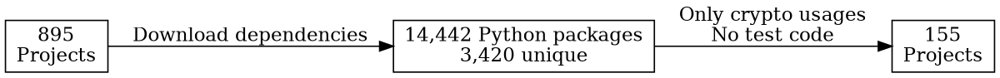
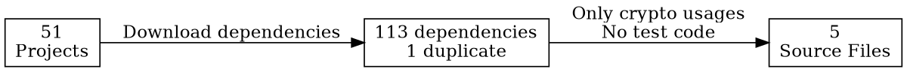

## Python Crypto Misuses 
## in the Wild

<u>Anna-Katharina Wickert</u>, Lars Baumgärtner, 
Florian Breitfelder, Mira Mezini

  

note:
Thanks for the introduction. Today, I will present our work on crypto misuses in Python. Let's start with our motivation for this work. 

---

### Motivation

    

In-the-wild studies | **Java**
Apps with **84.8 % - 99.6 % misuses**
<small id="tinygrey">:page_facing_up: Egele et al., "An Empirical Study of Cryptographic Misuse in Android Applications", CCS13</small>
<small id="tinygrey">:page_facing_up: Krüger et al., "CrySL: An Extensible Approach to Validating the Correct Usage of Cryptographic APIs", ECOOP18</small>
<small id="tinygrey">:page_facing_up: Hazhirpasand et al., "Java Cryptography Uses in the Wild", ESEM20</small>

 

    

Controlled-experiment | **Python**
**31.5 %** insecure solutions    
<small id="tinygrey">:page_facing_up: Acar et al., "Security developer studies with github users: Exploring a convenience sample", SOUPS17 </small>

note: 
- previous alarming picture 
- focus Java & Android apps
- 85% to 100% misuse
- other languages mostly out of focus
- underlying problem same primitives misused and not language concepts
- controlled experiment 3 crypto tasks 
- 31% solutions insecure
- raise question: How crypto APIs are misused in other languages and if the results of the experimt hold in-the-wild

Previous in-the-wild studies about security, e.g., crypto APIs, mostly draw an alarming picture of our software.
The focus of these studies are Java applications inlcuding Android apps. 
Of these programs which make use of a crypto API, 85 % to nearly 100%, have at least one misuse. 
Other languages are out of focus. However Underlying problem should be the same. 
A controlled experiment conducted with GitHub users for 3 different crypto-related tasks suggests that only 31% of the solutions are insecure. 
This raises the question how crypto APIs are misused in other languages and if the results of the experiment hold in-the-wild. 

---

### LICMA 

    

 https://github.com/stg-tud/licma
<small id="tinygrey">:page_facing_up: Egele et al., "An Empirical Study of Cryptographic Misuse in Android Applications", CCS13</small>

    
§1: Insecure block mode ECB 
§2: Non-random IV with block mode CBC
§3: Constant encryption key
§4: Constant salt for PBE
§5: Less than 1000 iterations PBE 
§6: Static seed secure random 

note: 
- answer question & support crypto analyses multiple languages LICMA
- 5 Python APIS
- Java's JCA
- Concentrate 6 standard misuses from literature 
- different API design sixth misuse Java not possible Python
- some API misuse by design
- PySalt avoid insecure block modes
- details on GitHub 

To answer this question and support crypto analyses for multiple languages, we developed LICMA, a multi-language analysis framework.
Currently, we support 5 different Python crypto APIs and Java's JCA to identify crypto misuses. 
We selected six standard misuses from literature. 
Due to the differen API design, the sixth misuse is not possible in all analyzed Python libraries. 
Further, some of these APIs avoid misuses completly by design, e.g., PySalt do not support the AES block mode ECB which is considered as insecure. 
You can find more details on our analysis in our GitHub project. 

---

### Experimental Evaluation
    
| | |
|---| ---|
| **Projects** | |
| &nbsp; Analyzed | 155 |
| &nbsp; Misused | 81 (52.3 %) |
|  |  |
| **Misuses** | 1,501 |
|  |  |

note: 
- 895 top Python projects
- 155 crypto usage in production code
- Every second a misuse - more positive than Java
- 1,501 total 

To take our analysis into the wild, we applied our analysis on a set of 155 Python applications with crypto usages in production code. 
Every second a misuse - shed more positive than Java
    

---

### Results Dependencies

note:
- 12 projects misuse in app code
- graph top-misuse projects
- only 4 misuse in library 
- scapy library itself only misuse in app code

Projects with Misuse in App | 12 (14.8 %)|
The graph on the right confirms. 
Only four of the ten top-misused apps have a misuse in a library including the library scapy which only have misuses in the app code. 

---

### Results APIs

note:
- misuse not evenly distributed among four library
- cryptography block mode contrast M2Crypto

When looking into the results in more depth, we observe that the misuses are not evenly distributed among the four libraries.
Most notably we find that we can only find a few misuses due to insecure block cipher modes. 
While most of the misuses for M2Crypto are related to insecure block cipher modes, rule 1 and 2, cryptography has only a few misuses. 

---

### Good API Design

    

note:
- Assumption: Design API
- two layers: high-level class avoid misuses
- actively warning 

We assume that this observation is due to the design of the cryptography library.
The library encourages developers to use a high-level class which avoids these misuses instead of relying on the provided low-level implementations. 

---

### Comparison with Previous Studies

<small id="tinygrey">:page_facing_up: Egele et al., "An Empirical Study of Cryptographic Misuse in Android Applications", CCS13
:page_facing_up: Zhang et al., "CryptoREX: Large-scale Analysis of Cryptographic Misuse in IoT Devices", RAID19 
:page_facing_up: Wickert et al., "Python Crypto Misuses in the Wild", ESEM21</small>

note:
- shed light comparison
- general lower in Python than Java and C
- remarkable rule 1 ECB - standard in Java
- hypothesize also due to API design

After I have presented you the results which focused on the misuses we observed for Python, I want to shed a light on the question if the Python crypto APIs help developers in writing more secure code. 
Thus, we compare our results in percentages with previous studies on the same rule set in Java and C. 
The comparison reveals that the percentage of applications with a misuse for each rule is in general lower in Python than in Java and C.
The most remarkable difference is for rule 1 which prohibits the usage of the block mode ECB. 
While it is the most-misused one for Java and C, only 3% of the Python applications include this misuse. 
We hypothesize that this difference is due to the impact of the API design I discussed with you earlier. 

---

 
### The talk in a :chestnut: :shell: 
:page_facing_up: https://arxiv.org/abs/2109.01109
 

note:
- To sum up my talk
- LICMA support JCA, 5 Python APIs  
- Every second app secure 
- Coparison seem support Python less misuses
- Hypothesize API design 
- Check out our data and LICMA
- THANKS LISTENING

To sum up my talk, we started with the question if crypto misuses occur less frequently in Python motivated by a promising user study.
We have shown that the number of applications with misuses is indeed lower as "only" every second has a potential misuse. 
Further, our results may indicate that the design of the *cryptography* library which recommend a class which avoids common misuses in Java help Python developers in writing secure code. 
Our meta-analysis confirms this impression as the most-common misuse in Java and C, occurs only in 3 % of the Python applications. 

---

## Backup slides

----

#### Misuse Rules and Python

----

#### LICMA Analysis Framework

----

#### Data set: Python apps

note:
To take our analysis into the wild, we applied our analysis on a set of Python and MicroPython applications, which we collected. 
For the Python applications, we downloaded 895 Python apps, and their dependencies with pip being the standard dependency manager for Python. 
This, resulted in 14,442 Python packages of which 3,420 are unique.
As we are interested in crypto usages, we filtered out these class files which do not use crypto or are test files.
This filter step, reduced our data set to 155 projects. 

----

#### Misuses among 4 Python Libraries

----

#### MicroPython: Data Set

|   | |
| --- | --- |
| Misuses LICMA | 0 |
| Grep 5 additional files | |
| &nbsp; *ucryptolib* test | 2 |
| &nbsp; crytpo in C | 3 | 

note:
top-announced MicroPython projects

----

#### Java: CryptoBench

| | **LICMA** | **CogniCrypt** | **Cryptoguard** |
| --- | --- | --- | --- |
| Positive test cases | 26 | 50 | 20 |
| &nbsp; Percentage | 42.27% | 79.37% | 46.03% |
| Negative test cases | 9 | 7 | 7 |
| &nbsp; Percentage | 60.00% | 46.67% | 46.67% |

